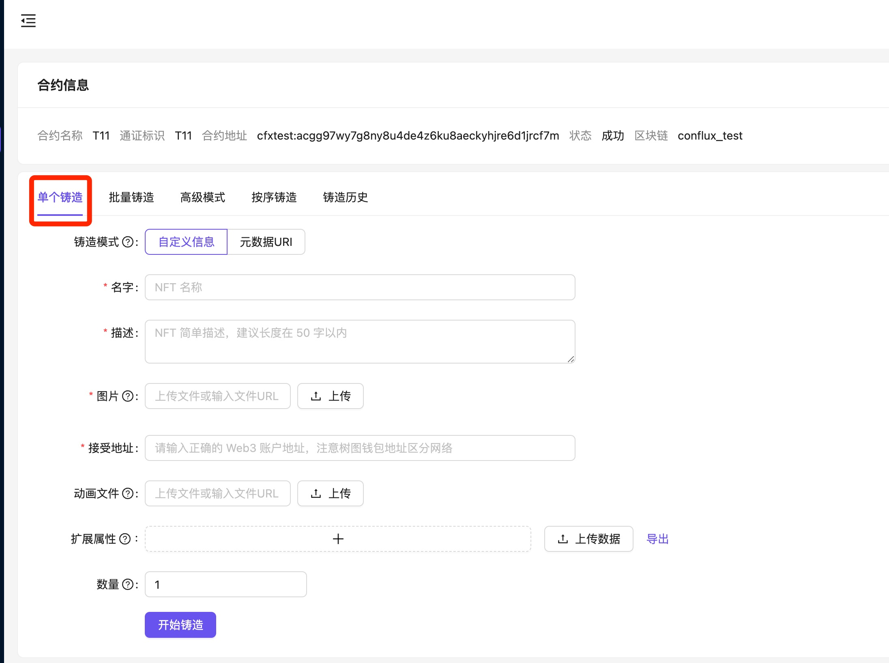
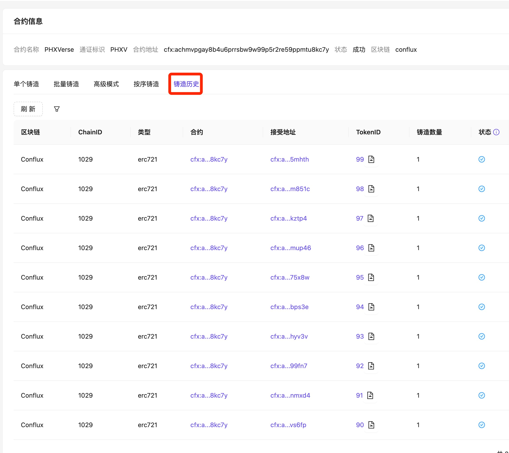
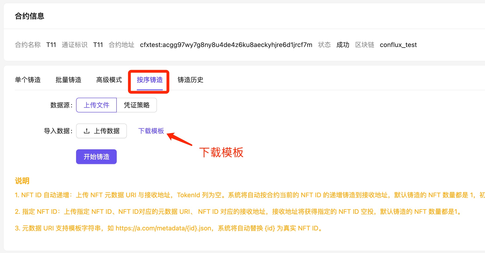
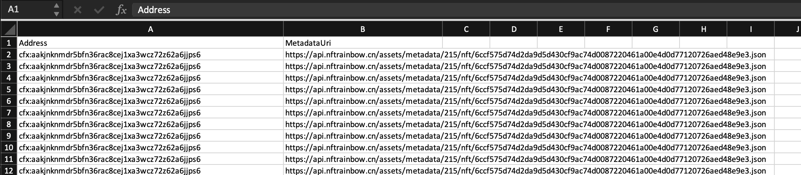

# Rainbow 铸造工具简介

Rainbow 在 Console 端提供了一些常用的 NFT 铸造工具, 包括:

* 单个铸造
* 批量铸造
* 按序铸造

可以满足大部分的非编程铸造需求.

铸造工具的入口在`智能合约`页面, 如果你还没有`部署合约` 需要先点击 `部署合约`按钮部署一个, 待合约部署交易上链执行成功之后, 刷新即可看到该合约.
在每个合约的右侧有一个 `铸造 NFT` 链接, 点击即可进入到铸造工具页面.

注意: 合约需要`设置好代付`或开启`代付自动设置功能`才能进行 NFT 铸造, 具体参看[代付操作说明](kong-zhi-tai-he-yue-dai-fu-she-zhi.md)

## 单个铸造

单个铸造适用于直接上传图片并编辑 NFT 信息然后直接铸造 NFT 至指定 Web3 账户, 同时也支持直接使用`元数据 uri`进行铸造.

铸造任务提交后, Rainbow 后台会自动做上链处理, 铸造状态可在 `铸造历史`页面查看

## 按序铸造

按序铸造可实现一次铸造多个 NFT, 且保证 NFT 的 TokenId 按序递增. 铸造 NFT 的元数据 url 需要提前准备好(可以使用 Rainbow 的元数据管理工具). 
铸造流程如下:

1. 下载铸造任务模板文件.
2. 编辑文件, 设置铸造任务
3. 提交
4. 在铸造历史查看

### 任务模板

铸造任务文件, 一行即是一个铸造任务.

1. Address: NFT 的接受账户, 通常为 Web3 地址, 也可以填手机号(会发送至手机号对应的晒啦钱包)
2. MetadataUri: NFT metadata uri 链接, 该 url 也支持模版字符串如 https://a.com/{id}.json
3. TokenId(可选): 指定 NFT 的 ID, 不填的话, 自动递增. 

### FAQs

1. 按序铸造一次性可以铸造多少 NFT?

5000

2. 文件提交后如何查看铸造结果?

可在`铸造历史`页面查看铸造状态