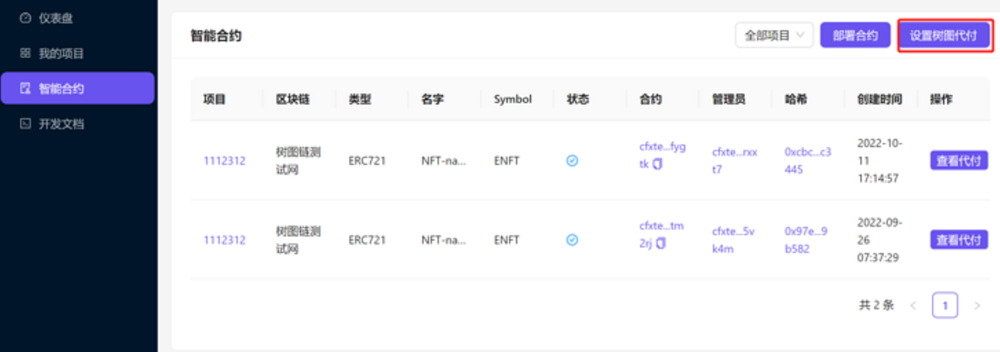

# 控制台合约代付设置

## 基本介绍

合约代付是Conflux独有的机制，项目方能够通过为合约设置代付与设置白名单，使得在白名单内用户能够在不使用自己的代币的同时完成与合约的交互。具体的代付概念可见[树图Contract Sponsor.](https://docs.nftrainbow.xyz/docs/shu-tu-contract-sponsor)

NFTRainbow提供了合约设置代付的接口，项目方在发布了自己的合约并为其设置代付后，其生态用户就可以铸造其自己的NFT，在这个角度上，能够推进项目的发展。

## 代付流程

项目方通过Rainbow发布NFT的费用将和接口调用数目挂钩。具体的价格，可见[https://docs.nftrainbow.xyz/docs/price](https://docs.nftrainbow.xyz/docs/price)。为了支付这笔费用，项目方先要通过法币充值功能，为自己的账户充值，再设置代付。

### 充值

通过控制台右上角的`用户余额`进入充值页面。&#x20;

<figure><figcaption></figcaption></figure>

点击`充值`按钮，进入充值流程。目前Rainbow支持微信支付，后续还有开启其他法币充值渠道。&#x20;

<figure><figcaption></figcaption></figure>

输入充值的金额后，页面就会弹出支付二维码。通过微信扫码后并支付费用后，可用额度就会增加。&#x20;

<figure><figcaption></figcaption></figure>

### 设置代付

项目方在充值完后，可以为合约设置代付。

点击`智能合约`页面的`设置树图代付`按钮，进入代付流程&#x20;

<figure><figcaption></figcaption></figure>

可以看到，代付页面主要包含四个参数，分别为`合约地址`、`燃气数量`、`燃气上限`、`存储数量`。&#x20;

<figure><figcaption></figcaption></figure>

其中，`合约地址`是我们想要去赞助的合约，可以是项目方部署的合约，也可以是其他人的合约。若该合约是项目方通过Rainbow部署的，则在部署合约页面能够获取到合约地址&#x20;

<figure><figcaption></figcaption></figure>

燃气是合约运行的燃料，合约的运行离不开燃气。设置代付需要对合约的`燃气数量`与`燃气上限`进行设置。燃气数量为项目方为该合约设置的燃气总数，用户调用该合约需要消耗对应的燃气数量，燃气上限为用户调用合约会消耗的燃气上限。

合约的代码与数据的存储需要消耗空间，这部分的数据将被上链。项目方需要为其付费。因此，`存储数量`也需要进行设置。

燃气数量与燃气上限及存储的详细介绍可以参考[树图Contract Sponsor.](https://docs.nftrainbow.xyz/docs/shu-tu-contract-sponsor)

由于`燃气数量`、`燃气上限`、`存储数量`都是与CFX相挂钩的，所以这里的单位都是CFX与GDrip。其中，CFX与GDrip的关系为1CFX=1000000000 GDrip (9个0)。另外，, 燃气数量需大于 1000 \* 燃气上限值。

以721合约为例，一个NFT的铸造需要消耗0.6个CFX，其中，燃气的消耗为20w GDrip。因此，在设置代付参数时，燃气上限建议值为100wGDrip，燃气数量可以设为1-5个CFX。对于存储数量，可以将其设为NFT的发行量\*0.6个CFX。

在填入对应的数据后，点击`提交`，就能够实现对应的代付。代付的提交需要上链，因此中间需要几分钟的时间。&#x20;

<figure><figcaption></figcaption></figure>

### 设置白名单

在为合约实现代付后，用户需要为白名单进行设置。若白名单内包括零地址，则意味着任何人都可以通过代付去调用该合约。具体的配置可以通过[Add Contract Sponsor Users接口](https://docs.nftrainbow.xyz/api-reference/open-api/contract)实现。

\[1] [Conflux存储介绍](https://forum.conflux.fun/t/conflux/11947)
