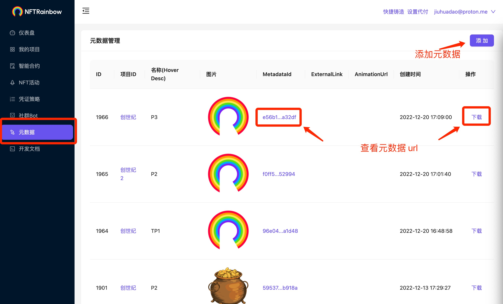
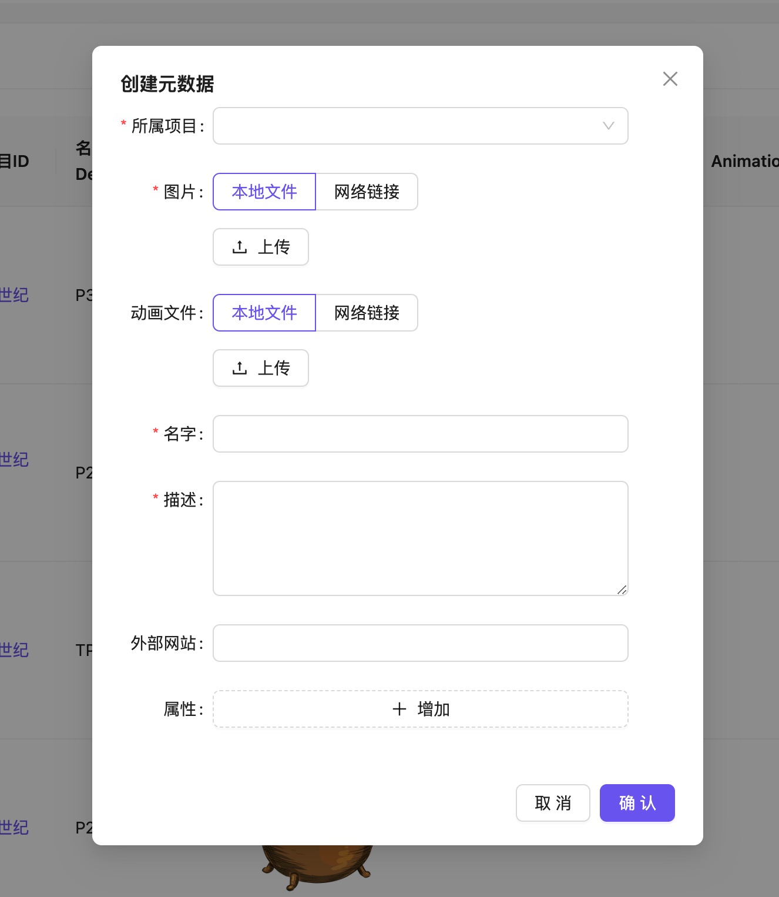

# NFT 元数据管理

Rainbow 控制台支持 NFT 元数据管理，包括 NFT 元数据上传、NFT 元数据查看等功能. 在这里可以查看 Rainbow 接口调用或 NFT 活动使用过程中产生的元数据信息. 也可以直接创建元数据以用于 NFT 铸造

通过点击 `MetadataId` 或 `下载` 按钮可以查看元数据的完整信息, 以及 url (浏览器地址框中的 url).

```txt
https://api.nftrainbow.cn/assets/metadata/1/nft/d2511cea559b14e324444a1a459d6b4a8497e1223b712a1dee6f32ea9e5281fc.json
```

该 url 可以在 NFT 铸造时使用, Rainbow 合约的藏品铸造页面多个地方可以直接使用该 url.



点击 `添加` 按钮, 即可打开元数据创建弹窗, 输入必要信息及上传文件(或输入文件 url)后, 即可轻松创建一个 NFT 元数据. 必要信息包括:

1. 所属项目
2. 图片
3. 名字
4. 描述: NFT 介绍



关于 NFT 元数据标准内容参看: https://docs.opensea.io/docs/metadata-standards