# Rainbow Activity

Rainbow Activity 方便项目方发行活动纪念或奖章类 NFT（如 POAP），并提供统一的领取页面。控制台入口：[NFTRainbow Console](https://console.nftrainbow.cn)。

## 准备工作

创建活动前，请先完成以下步骤：

1. 注册并登录 [NFTRainbow 控制台](https://console.nftrainbow.cn)
2. 在右上角提交实名信息，等待审核通过
3. 创建项目并部署合约
4. 为合约设置代付：需先在右上角完成充值。单个 NFT 存储消耗约 `0.6–0.7 CFX`，建议按发行量预留（例如 100 个 NFT 可设置约 `70 CFX` 代付）。详见 [控制台合约代付设置](kong-zhi-tai-he-yue-dai-fu-she-zhi.md)

## 项目方：创建活动并发放链接

1. 在 NFT 活动页面，点击 `创建活动/创建POAP`

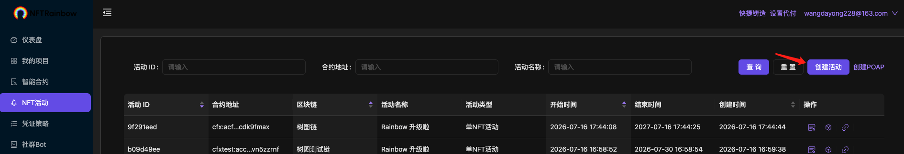

2. 填写活动详情（名称、说明、徽章图片等）

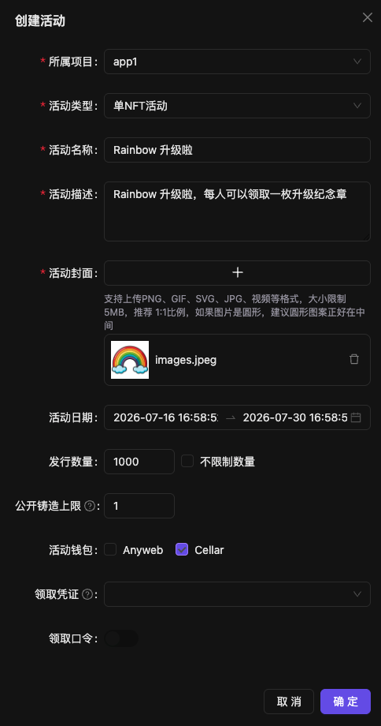

3. 点击 `管理藏品`

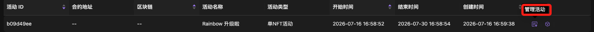

4. 绑定已部署的合约（合约需已完成代付设置）

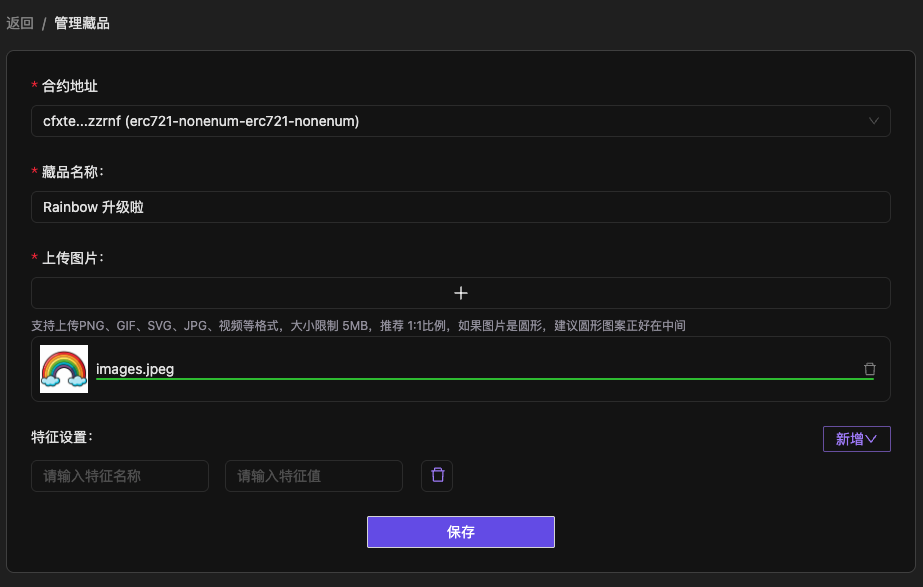

5. 保存后返回活动列表，点击活动链接即可打开领取页面，可将该链接发给用户

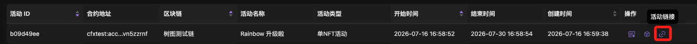

## 用户：领取 NFT

1. 用户通过活动链接进入领取页面

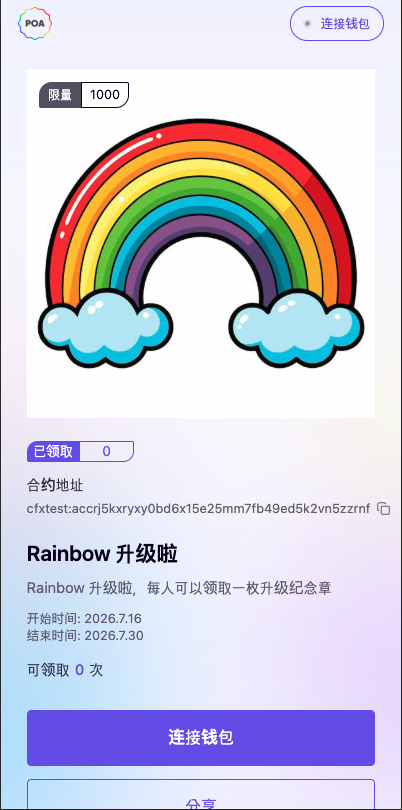

2. 点击 `连接钱包`，输入手机号码登录

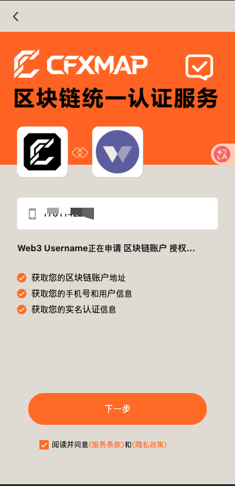

3. 授权账户

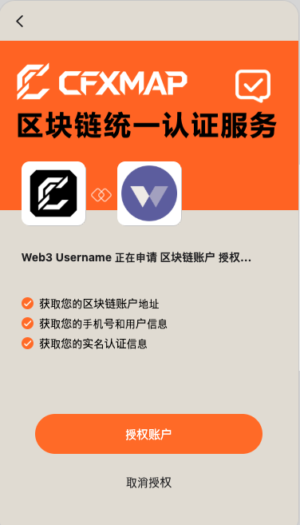

4. 右上角显示钱包已连接后，点击 `领取` 按钮领取 NFT

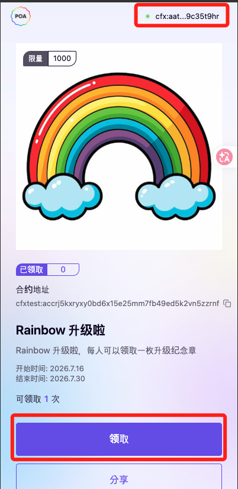

5. 等待数十秒，领取完成后点击去钱包查看

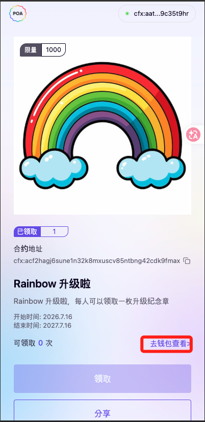

6. 登录晒啦钱包，即可看到刚领取的 NFT

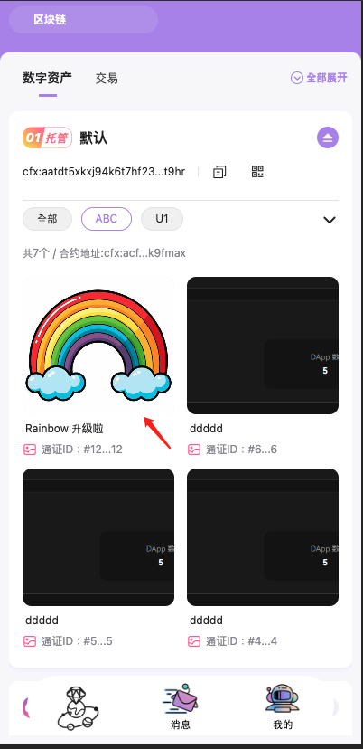
